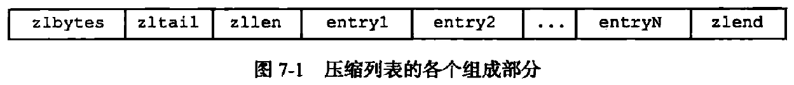

### 压缩链表节点信息结构

```cpp
/*
 * 保存 ziplist 节点信息的结构
 */
typedef struct zlentry {

    // prevrawlen ：前置节点的长度
    // prevrawlensize ：编码 prevrawlen 所需的字节大小
    unsigned int prevrawlensize, prevrawlen;

    // len ：当前节点值的长度
    // lensize ：编码 len 所需的字节大小
    unsigned int lensize, len;

    // 当前节点 header 的大小
    // 等于 prevrawlensize + lensize
    unsigned int headersize;

    // 当前节点值所使用的编码类型
    unsigned char encoding;

    // 指向当前节点的指针
    unsigned char *p;

} zlentry;
```

**previous_entry_length**

记录了前一个结点的长度，程序可以通过指针运算，根据当前节点的起始地址来计算出前一个节点的起始地址。

**encoding**

该属性记录了节点的 `content`属性所保存数据类型以及长度，通过该属性的最高两位字节，可以判断 `content`中保存的是字节数组还是整数值。

**content**

该属性负责保存节点的值，节点值可以是字节数组或整数，值的类型和长度有 `encoding`来确定。

### 连锁更新

由插入或者删除节点造成的连续多次空间扩展操作称之为“连锁更新”。连锁更新现象的存在会导致压缩列表的时间复杂度退化为 `O(N^2)`。

### 压缩列表API

**ziplistNew**

作用：创建一个新的压缩列表

时间复杂度：O(1)



```cpp
/* Create a new empty ziplist. 
 *
 * 创建并返回一个新的 ziplist 
 *
 * T = O(1)
 */
unsigned char *ziplistNew(void) {

    // ZIPLIST_HEADER_SIZE 是 ziplist 表头的大小
    // 1 字节是表末端 ZIP_END 的大小
    unsigned int bytes = ZIPLIST_HEADER_SIZE+1;

    // 为表头和表末端分配空间
    unsigned char *zl = zmalloc(bytes);

    // 初始化表属性
    ZIPLIST_BYTES(zl) = intrev32ifbe(bytes);
    ZIPLIST_TAIL_OFFSET(zl) = intrev32ifbe(ZIPLIST_HEADER_SIZE);
    ZIPLIST_LENGTH(zl) = 0;

    // 设置表末端
    zl[bytes-1] = ZIP_END;

    return zl;
}
```

**ziplistPush**

作用：创建一个包含给定值的新节点，并将这个节点添加到压缩列表的表头或表尾

时间复杂度：平均O(N)，最坏O(N^2)

```cpp
/*
 * 将长度为 slen 的字符串 s 推入到 zl 中。
 *
 * where 参数的值决定了推入的方向：
 * - 值为 ZIPLIST_HEAD 时，将新值推入到表头。
 * - 否则，将新值推入到表末端。
 *
 * 函数的返回值为添加新值后的 ziplist 。
 *
 * T = O(N^2)
 */
unsigned char *ziplistPush(unsigned char *zl, unsigned char *s, unsigned int slen, int where) {

    // 根据 where 参数的值，决定将值推入到表头还是表尾
    unsigned char *p;
    p = (where == ZIPLIST_HEAD) ? ZIPLIST_ENTRY_HEAD(zl) : ZIPLIST_ENTRY_END(zl);

    // 返回添加新值后的 ziplist
    // T = O(N^2)
    return
```

**ziplistInsert**

作用：将包含给定值的新节点插入到给定结点之后

时间复杂度：平均O(N)，最坏O(N^2)

```cpp
/* Encode the length 'l' writing it in 'p'. If p is NULL it just returns
 * the amount of bytes required to encode such a length. 
 *
 * 编码节点长度值 l ，并将它写入到 p 中，然后返回编码 l 所需的字节数量。
 *
 * 如果 p 为 NULL ，那么仅返回编码 l 所需的字节数量，不进行写入。
 *
 * T = O(1)
 */
static unsigned int zipEncodeLength(unsigned char *p, unsigned char encoding, unsigned int rawlen) {
    unsigned char len = 1, buf[5];

    // 编码字符串
    if (ZIP_IS_STR(encoding)) {
        /* Although encoding is given it may not be set for strings,
         * so we determine it here using the raw length. */
        if (rawlen <= 0x3f) {
            if (!p) return len;
            buf[0] = ZIP_STR_06B | rawlen;
        } else if (rawlen <= 0x3fff) {
            len += 1;
            if (!p) return len;
            buf[0] = ZIP_STR_14B | ((rawlen >> 8) & 0x3f);
            buf[1] = rawlen & 0xff;
        } else {
            len += 4;
            if (!p) return len;
            buf[0] = ZIP_STR_32B;
            buf[1] = (rawlen >> 24) & 0xff;
            buf[2] = (rawlen >> 16) & 0xff;
            buf[3] = (rawlen >> 8) & 0xff;
            buf[4] = rawlen & 0xff;
        }

    // 编码整数
    } else {
        /* Implies integer encoding, so length is always 1. */
        if (!p) return len;
        buf[0] = encoding;
    }

    /* Store this length at p */
    // 将编码后的长度写入 p 
    memcpy(p,buf,len);

    // 返回编码所需的字节数
    return len;
}

/* Encode the length of the previous entry and write it to "p". Return the
 * number of bytes needed to encode this length if "p" is NULL. 
 *
 * 对前置节点的长度 len 进行编码，并将它写入到 p 中，
 * 然后返回编码 len 所需的字节数量。
 *
 * 如果 p 为 NULL ，那么不进行写入，仅返回编码 len 所需的字节数量。
 *
 * T = O(1)
 */
static unsigned int zipPrevEncodeLength(unsigned char *p, unsigned int len) {

    // 仅返回编码 len 所需的字节数量
    if (p == NULL) {
        return (len < ZIP_BIGLEN) ? 1 : sizeof(len)+1;

    // 写入并返回编码 len 所需的字节数量
    } else {

        // 1 字节
        if (len < ZIP_BIGLEN) {
            p[0] = len;
            return 1;

        // 5 字节
        } else {
            // 添加 5 字节长度标识
            p[0] = ZIP_BIGLEN;
            // 写入编码
            memcpy(p+1,&len,sizeof(len));
            // 如果有必要的话，进行大小端转换
            memrev32ifbe(p+1);
            // 返回编码长度
            return 1+sizeof(len);
        }
    }
}

// 返回指向 ziplist 第一个节点（的起始位置）的指针
#define ZIPLIST_ENTRY_HEAD(zl)  ((zl)+ZIPLIST_HEADER_SIZE)
// 返回指向 ziplist 最后一个节点（的起始位置）的指针
#define ZIPLIST_ENTRY_TAIL(zl)  ((zl)+intrev32ifbe(ZIPLIST_TAIL_OFFSET(zl)))

/*
 * 将长度为 slen 的字符串 s 推入到 zl 中。
 *
 * where 参数的值决定了推入的方向：
 * - 值为 ZIPLIST_HEAD 时，将新值推入到表头。
 * - 否则，将新值推入到表末端。
 *
 * 函数的返回值为添加新值后的 ziplist 。
 *
 * T = O(N^2)
 */
unsigned char *ziplistPush(unsigned char *zl, unsigned char *s, unsigned int slen, int where) {

    // 根据 where 参数的值，决定将值推入到表头还是表尾
    unsigned char *p;
    p = (where == ZIPLIST_HEAD) ? ZIPLIST_ENTRY_HEAD(zl) : ZIPLIST_ENTRY_END(zl);

    // 返回添加新值后的 ziplist
    // T = O(N^2)
    return __ziplistInsert(zl,p,s,slen);
}

/* Insert item at "p". */
/*
 * 根据指针 p 所指定的位置，将长度为 slen 的字符串 s 插入到 zl 中。
 *
 * 函数的返回值为完成插入操作之后的 ziplist
 *
 * T = O(N^2)
 */
static unsigned char *__ziplistInsert(unsigned char *zl, unsigned char *p, unsigned char *s, unsigned int slen) {
    // 记录当前 ziplist 的长度
    size_t curlen = intrev32ifbe(ZIPLIST_BYTES(zl)), reqlen, prevlen = 0;
    size_t offset;
    int nextdiff = 0;
    unsigned char encoding = 0;
    long long value = 123456789; /* initialized to avoid warning. Using a value
                                    that is easy to see if for some reason
                                    we use it uninitialized. */
    zlentry entry, tail;

    /* Find out prevlen for the entry that is inserted. */
    if (p[0] != ZIP_END) {
        // 如果 p[0] 不指向列表末端，说明列表非空，并且 p 正指向列表的其中一个节点
        // 那么取出 p 所指向节点的信息，并将它保存到 entry 结构中
        // 然后用 prevlen 变量记录前置节点的长度
        // （当插入新节点之后 p 所指向的节点就成了新节点的前置节点）
        // T = O(1)
        entry = zipEntry(p);
        prevlen = entry.prevrawlen;
    } else {
        // 如果 p 指向表尾末端，那么程序需要检查列表是否为：
        // 1)如果 ptail 也指向 ZIP_END ，那么列表为空；
        // 2)如果列表不为空，那么 ptail 将指向列表的最后一个节点。
        unsigned char *ptail = ZIPLIST_ENTRY_TAIL(zl);
        if (ptail[0] != ZIP_END) {
            // 表尾节点为新节点的前置节点

            // 取出表尾节点的长度
            // T = O(1)
            prevlen = zipRawEntryLength(ptail);
        }
    }

    /* See if the entry can be encoded */
    // 尝试看能否将输入字符串转换为整数，如果成功的话：
    // 1)value 将保存转换后的整数值
    // 2)encoding 则保存适用于 value 的编码方式
    // 无论使用什么编码， reqlen 都保存节点值的长度
    // T = O(N)
    if (zipTryEncoding(s,slen,&value,&encoding)) {
        /* 'encoding' is set to the appropriate integer encoding */
        reqlen = zipIntSize(encoding);
    } else {
        /* 'encoding' is untouched, however zipEncodeLength will use the
         * string length to figure out how to encode it. */
        reqlen = slen;
    }
    /* We need space for both the length of the previous entry and
     * the length of the payload. */
    // 计算编码前置节点的长度所需的大小
    // T = O(1)
    reqlen += zipPrevEncodeLength(NULL,prevlen);
    // 计算编码当前节点值所需的大小
    // T = O(1)
    reqlen += zipEncodeLength(NULL,encoding,slen);

    /* When the insert position is not equal to the tail, we need to
     * make sure that the next entry can hold this entry's length in
     * its prevlen field. */
    // 只要新节点不是被添加到列表末端，
    // 那么程序就需要检查看 p 所指向的节点（的 header）能否编码新节点的长度。
    // nextdiff 保存了新旧编码之间的字节大小差，如果这个值大于 0 
    // 那么说明需要对 p 所指向的节点（的 header ）进行扩展
    // T = O(1)
    nextdiff = (p[0] != ZIP_END) ? zipPrevLenByteDiff(p,reqlen) : 0;

    /* Store offset because a realloc may change the address of zl. */
    // 因为重分配空间可能会改变 zl 的地址
    // 所以在分配之前，需要记录 zl 到 p 的偏移量，然后在分配之后依靠偏移量还原 p 
    offset = p-zl;
    // curlen 是 ziplist 原来的长度
    // reqlen 是整个新节点的长度
    // nextdiff 是新节点的后继节点扩展 header 的长度（要么 0 字节，要么 4 个字节）
    // T = O(N)
    zl = ziplistResize(zl,curlen+reqlen+nextdiff);
    p = zl+offset;

    /* Apply memory move when necessary and update tail offset. */
    if (p[0] != ZIP_END) {
        // 新元素之后还有节点，因为新元素的加入，需要对这些原有节点进行调整

        /* Subtract one because of the ZIP_END bytes */
        // 移动现有元素，为新元素的插入空间腾出位置
        // T = O(N)
        memmove(p+reqlen,p-nextdiff,curlen-offset-1+nextdiff);

        /* Encode this entry's raw length in the next entry. */
        // 将新节点的长度编码至后置节点
        // p+reqlen 定位到后置节点
        // reqlen 是新节点的长度
        // T = O(1)
        zipPrevEncodeLength(p+reqlen,reqlen);

        /* Update offset for tail */
        // 更新到达表尾的偏移量，将新节点的长度也算上
        ZIPLIST_TAIL_OFFSET(zl) =
            intrev32ifbe(intrev32ifbe(ZIPLIST_TAIL_OFFSET(zl))+reqlen);

        /* When the tail contains more than one entry, we need to take
         * "nextdiff" in account as well. Otherwise, a change in the
         * size of prevlen doesn't have an effect on the *tail* offset. */
        // 如果新节点的后面有多于一个节点
        // 那么程序需要将 nextdiff 记录的字节数也计算到表尾偏移量中
        // 这样才能让表尾偏移量正确对齐表尾节点
        // T = O(1)
        tail = zipEntry(p+reqlen);
        if (p[reqlen+tail.headersize+tail.len] != ZIP_END) {
            ZIPLIST_TAIL_OFFSET(zl) =
                intrev32ifbe(intrev32ifbe(ZIPLIST_TAIL_OFFSET(zl))+nextdiff);
        }
    } else {
        /* This element will be the new tail. */
        // 新元素是新的表尾节点
        ZIPLIST_TAIL_OFFSET(zl) = intrev32ifbe(p-zl);
    }

    /* When nextdiff != 0, the raw length of the next entry has changed, so
     * we need to cascade the update throughout the ziplist */
    // 当 nextdiff != 0 时，新节点的后继节点的（header 部分）长度已经被改变，
    // 所以需要级联地更新后续的节点
    if (nextdiff != 0) {
        offset = p-zl;
        // T  = O(N^2)
        zl = __ziplistCascadeUpdate(zl,p+reqlen);
        p = zl+offset;
    }

    /* Write the entry */
    // 一切搞定，将前置节点的长度写入新节点的 header
    p += zipPrevEncodeLength(p,prevlen);
    // 将节点值的长度写入新节点的 header
    p += zipEncodeLength(p,encoding,slen);
    // 写入节点值
    if (ZIP_IS_STR(encoding)) {
        // T = O(N)
        memcpy(p,s,slen);
    } else {
        // T = O(1)
        zipSaveInteger(p,value,encoding);
    }

    // 更新列表的节点数量计数器
    // T = O(1)
    ZIPLIST_INCR_LENGTH(zl,1);

    return zl;
}
```

**ziplistIndex**

作用：返回压缩列表给定索引上的节点

时间复杂度：O(N)

```cpp
/* Returns an offset to use for iterating with ziplistNext. When the given
 * index is negative, the list is traversed back to front. When the list
 * doesn't contain an element at the provided index, NULL is returned. */
/*
 * 根据给定索引，遍历列表，并返回索引指定节点的指针。
 *
 * 如果索引为正，那么从表头向表尾遍历。
 * 如果索引为负，那么从表尾向表头遍历。
 * 正数索引从 0 开始，负数索引从 -1 开始。
 *
 * 如果索引超过列表的节点数量，或者列表为空，那么返回 NULL 。
 *
 * T = O(N)
 */
unsigned char *ziplistIndex(unsigned char *zl, int index) {

    unsigned char *p;

    zlentry entry;

    // 处理负数索引
    if (index < 0) {

        // 将索引转换为正数
        index = (-index)-1;
  
        // 定位到表尾节点
        p = ZIPLIST_ENTRY_TAIL(zl);

        // 如果列表不为空，那么。。。
        if (p[0] != ZIP_END) {

            // 从表尾向表头遍历
            entry = zipEntry(p);
            // T = O(N)
            while (entry.prevrawlen > 0 && index--) {
                // 前移指针
                p -= entry.prevrawlen;
                // T = O(1)
                entry = zipEntry(p);
            }
        }

    // 处理正数索引
    } else {

        // 定位到表头节点
        p = ZIPLIST_ENTRY_HEAD(zl);

        // T = O(N)
        while (p[0] != ZIP_END && index--) {
            // 后移指针
            // T = O(1)
            p += zipRawEntryLength(p);
        }
    }

    // 返回结果
    return (p[0] == ZIP_END || index > 0) ? NULL : p;
}
```

**ziplistFind**

作用：在压缩列表中查找并返回包含了给定值的节点

时间复杂度：O(N^2)

```cpp
/* Find pointer to the entry equal to the specified entry. 
 * 
 * 寻找节点值和 vstr 相等的列表节点，并返回该节点的指针。
 * 
 * Skip 'skip' entries between every comparison. 
 *
 * 每次比对之前都跳过 skip 个节点。
 *
 * Returns NULL when the field could not be found. 
 *
 * 如果找不到相应的节点，则返回 NULL 。
 *
 * T = O(N^2)
 */
unsigned char *ziplistFind(unsigned char *p, unsigned char *vstr, unsigned int vlen, unsigned int skip) {
    int skipcnt = 0;
    unsigned char vencoding = 0;
    long long vll = 0;

    // 只要未到达列表末端，就一直迭代
    // T = O(N^2)
    while (p[0] != ZIP_END) {
        unsigned int prevlensize, encoding, lensize, len;
        unsigned char *q;

        ZIP_DECODE_PREVLENSIZE(p, prevlensize);
        ZIP_DECODE_LENGTH(p + prevlensize, encoding, lensize, len);
        q = p + prevlensize + lensize;

        if (skipcnt == 0) {

            /* Compare current entry with specified entry */
            // 对比字符串值
            // T = O(N)
            if (ZIP_IS_STR(encoding)) {
                if (len == vlen && memcmp(q, vstr, vlen) == 0) {
                    return p;
                }
            } else {
                /* Find out if the searched field can be encoded. Note that
                 * we do it only the first time, once done vencoding is set
                 * to non-zero and vll is set to the integer value. */
                // 因为传入值有可能被编码了，
                // 所以当第一次进行值对比时，程序会对传入值进行解码
                // 这个解码操作只会进行一次
                if (vencoding == 0) {
                    if (!zipTryEncoding(vstr, vlen, &vll, &vencoding)) {
                        /* If the entry can't be encoded we set it to
                         * UCHAR_MAX so that we don't retry again the next
                         * time. */
                        vencoding = UCHAR_MAX;
                    }
                    /* Must be non-zero by now */
                    assert(vencoding);
                }

                /* Compare current entry with specified entry, do it only
                 * if vencoding != UCHAR_MAX because if there is no encoding
                 * possible for the field it can't be a valid integer. */
                // 对比整数值
                if (vencoding != UCHAR_MAX) {
                    // T = O(1)
                    long long ll = zipLoadInteger(q, encoding);
                    if (ll == vll) {
                        return p;
                    }
                }
            }

            /* Reset skip count */
            skipcnt = skip;
        } else {
            /* Skip entry */
            skipcnt--;
        }

        /* Move to next entry */
        // 后移指针，指向后置节点
        p = q + len;
    }

    // 没有找到指定的节点
    return NULL;
}
```

**ziplistNext**

作用：返回给定节点的下一个节点

时间复杂度：O(1)

```cpp
/* Return pointer to next entry in ziplist.
 *
 * zl is the pointer to the ziplist
 * p is the pointer to the current element
 *
 * The element after 'p' is returned, otherwise NULL if we are at the end. */
/*
 * 返回 p 所指向节点的后置节点。
 *
 * 如果 p 为表末端，或者 p 已经是表尾节点，那么返回 NULL 。
 *
 * T = O(1)
 */
unsigned char *ziplistNext(unsigned char *zl, unsigned char *p) {
    ((void) zl);

    /* "p" could be equal to ZIP_END, caused by ziplistDelete,
     * and we should return NULL. Otherwise, we should return NULL
     * when the *next* element is ZIP_END (there is no next entry). */
    // p 已经指向列表末端
    if (p[0] == ZIP_END) {
        return NULL;
    }

    // 指向后一节点
    p += zipRawEntryLength(p);
    if (p[0] == ZIP_END) {
        // p 已经是表尾节点，没有后置节点
        return NULL;
    }

    return p;
}
```

**ziplistPrev**

作用：返回给定节点的前一个节点

时间复杂度：O(1)

```cpp
/* Return pointer to previous entry in ziplist. */
/*
 * 返回 p 所指向节点的前置节点。
 *
 * 如果 p 所指向为空列表，或者 p 已经指向表头节点，那么返回 NULL 。
 *
 * T = O(1)
 */
unsigned char *ziplistPrev(unsigned char *zl, unsigned char *p) {
    zlentry entry;

    /* Iterating backwards from ZIP_END should return the tail. When "p" is
     * equal to the first element of the list, we're already at the head,
     * and should return NULL. */
  
    // 如果 p 指向列表末端（列表为空，或者刚开始从表尾向表头迭代）
    // 那么尝试取出列表尾端节点
    if (p[0] == ZIP_END) {
        p = ZIPLIST_ENTRY_TAIL(zl);
        // 尾端节点也指向列表末端，那么列表为空
        return (p[0] == ZIP_END) ? NULL : p;
  
    // 如果 p 指向列表头，那么说明迭代已经完成
    } else if (p == ZIPLIST_ENTRY_HEAD(zl)) {
        return NULL;

    // 既不是表头也不是表尾，从表尾向表头移动指针
    } else {
        // 计算前一个节点的节点数
        entry = zipEntry(p);
        assert(entry.prevrawlen > 0);
        // 移动指针，指向前一个节点
        return p-entry.prevrawlen;
    }
}
```

**ziplistGet**

作用：获取给定节点所保存的值

时间复杂度：O(1)

```cpp
/* Get entry pointed to by 'p' and store in either 'e' or 'v' depending
 * on the encoding of the entry. 'e' is always set to NULL to be able
 * to find out whether the string pointer or the integer value was set.
 * Return 0 if 'p' points to the end of the ziplist, 1 otherwise. */
/*
 * 取出 p 所指向节点的值：
 *
 * - 如果节点保存的是字符串，那么将字符串值指针保存到 *sstr 中，字符串长度保存到 *slen
 *
 * - 如果节点保存的是整数，那么将整数保存到 *sval
 *
 * 程序可以通过检查 *sstr 是否为 NULL 来检查值是字符串还是整数。
 *
 * 提取值成功返回 1 ，
 * 如果 p 为空，或者 p 指向的是列表末端，那么返回 0 ，提取值失败。
 *
 * T = O(1)
 */
unsigned int ziplistGet(unsigned char *p, unsigned char **sstr, unsigned int *slen, long long *sval) {

    zlentry entry;
    if (p == NULL || p[0] == ZIP_END) return 0;
    if (sstr) *sstr = NULL;

    // 取出 p 所指向的节点的各项信息，并保存到结构 entry 中
    // T = O(1)
    entry = zipEntry(p);

    // 节点的值为字符串，将字符串长度保存到 *slen ，字符串保存到 *sstr
    // T = O(1)
    if (ZIP_IS_STR(entry.encoding)) {
        if (sstr) {
            *slen = entry.len;
            *sstr = p+entry.headersize;
        }
  
    // 节点的值为整数，解码值，并将值保存到 *sval
    // T = O(1)
    } else {
        if (sval) {
            *sval = zipLoadInteger(p+entry.headersize,entry.encoding);
        }
    }

    return 1;
}
```

**ziplistDelete**

作用：从压缩列表中删除给定的节点

时间复杂度：平均O(N)，最坏O(N^2)

```cpp
/* Delete a single entry from the ziplist, pointed to by *p.
 * Also update *p in place, to be able to iterate over the
 * ziplist, while deleting entries. 
 *
 * 从 zl 中删除 *p 所指向的节点，
 * 并且原地更新 *p 所指向的位置，使得可以在迭代列表的过程中对节点进行删除。
 *
 * T = O(N^2)
 */
unsigned char *ziplistDelete(unsigned char *zl, unsigned char **p) {

    // 因为 __ziplistDelete 时会对 zl 进行内存重分配
    // 而内存充分配可能会改变 zl 的内存地址
    // 所以这里需要记录到达 *p 的偏移量
    // 这样在删除节点之后就可以通过偏移量来将 *p 还原到正确的位置
    size_t offset = *p-zl;
    zl = __ziplistDelete(zl,*p,1);

    /* Store pointer to current element in p, because ziplistDelete will
     * do a realloc which might result in a different "zl"-pointer.
     * When the delete direction is back to front, we might delete the last
     * entry and end up with "p" pointing to ZIP_END, so check this. */
    *p = zl+offset;

    return zl;
}

/* Delete "num" entries, starting at "p". Returns pointer to the ziplist. 
 *
 * 从位置 p 开始，连续删除 num 个节点。
 *
 * 函数的返回值为处理删除操作之后的 ziplist 。
 *
 * T = O(N^2)
 */
static unsigned char *__ziplistDelete(unsigned char *zl, unsigned char *p, unsigned int num) {
    unsigned int i, totlen, deleted = 0;
    size_t offset;
    int nextdiff = 0;
    zlentry first, tail;

    // 计算被删除节点总共占用的内存字节数
    // 以及被删除节点的总个数
    // T = O(N)
    first = zipEntry(p);
    for (i = 0; p[0] != ZIP_END && i < num; i++) {
        p += zipRawEntryLength(p);
        deleted++;
    }

    // totlen 是所有被删除节点总共占用的内存字节数
    totlen = p-first.p;
    if (totlen > 0) {
        if (p[0] != ZIP_END) {

            // 执行这里，表示被删除节点之后仍然有节点存在

            /* Storing `prevrawlen` in this entry may increase or decrease the
             * number of bytes required compare to the current `prevrawlen`.
             * There always is room to store this, because it was previously
             * stored by an entry that is now being deleted. */
            // 因为位于被删除范围之后的第一个节点的 header 部分的大小
            // 可能容纳不了新的前置节点，所以需要计算新旧前置节点之间的字节数差
            // T = O(1)
            nextdiff = zipPrevLenByteDiff(p,first.prevrawlen);
            // 如果有需要的话，将指针 p 后退 nextdiff 字节，为新 header 空出空间
            p -= nextdiff;
            // 将 first 的前置节点的长度编码至 p 中
            // T = O(1)
            zipPrevEncodeLength(p,first.prevrawlen);

            /* Update offset for tail */
            // 更新到达表尾的偏移量
            // T = O(1)
            ZIPLIST_TAIL_OFFSET(zl) =
                intrev32ifbe(intrev32ifbe(ZIPLIST_TAIL_OFFSET(zl))-totlen);

            /* When the tail contains more than one entry, we need to take
             * "nextdiff" in account as well. Otherwise, a change in the
             * size of prevlen doesn't have an effect on the *tail* offset. */
            // 如果被删除节点之后，有多于一个节点
            // 那么程序需要将 nextdiff 记录的字节数也计算到表尾偏移量中
            // 这样才能让表尾偏移量正确对齐表尾节点
            // T = O(1)
            tail = zipEntry(p);
            if (p[tail.headersize+tail.len] != ZIP_END) {
                ZIPLIST_TAIL_OFFSET(zl) =
                   intrev32ifbe(intrev32ifbe(ZIPLIST_TAIL_OFFSET(zl))+nextdiff);
            }

            /* Move tail to the front of the ziplist */
            // 从表尾向表头移动数据，覆盖被删除节点的数据
            // T = O(N)
            memmove(first.p,p,
                intrev32ifbe(ZIPLIST_BYTES(zl))-(p-zl)-1);
        } else {

            // 执行这里，表示被删除节点之后已经没有其他节点了

            /* The entire tail was deleted. No need to move memory. */
            // T = O(1)
            ZIPLIST_TAIL_OFFSET(zl) =
                intrev32ifbe((first.p-zl)-first.prevrawlen);
        }

        /* Resize and update length */
        // 缩小并更新 ziplist 的长度
        offset = first.p-zl;
        zl = ziplistResize(zl, intrev32ifbe(ZIPLIST_BYTES(zl))-totlen+nextdiff);
        ZIPLIST_INCR_LENGTH(zl,-deleted);
        p = zl+offset;

        /* When nextdiff != 0, the raw length of the next entry has changed, so
         * we need to cascade the update throughout the ziplist */
        // 如果 p 所指向的节点的大小已经变更，那么进行级联更新
        // 检查 p 之后的所有节点是否符合 ziplist 的编码要求
        // T = O(N^2)
        if (nextdiff != 0)
            zl = __ziplistCascadeUpdate(zl,p);
    }

    return zl;
}
```

**ziplistDeleteRange**

作用：删除压缩列表在给定索引上的连续多个节点

时间复杂度：平均O(N)，最坏O(N^2)

```cpp
/* Delete a range of entries from the ziplist. 
 *
 * 从 index 索引指定的节点开始，连续地从 zl 中删除 num 个节点。
 *
 * T = O(N^2)
 */
unsigned char *ziplistDeleteRange(unsigned char *zl, unsigned int index, unsigned int num) {

    // 根据索引定位到节点
    // T = O(N)
    unsigned char *p = ziplistIndex(zl,index);

    // 连续删除 num 个节点
    // T = O(N^2)
    return (p == NULL) ? zl : __ziplistDelete(zl,p,num);
}
```

**ziplistBlobLen**

作用：返回压缩列表目前占用的内存字节数

时间复杂度：O(1)

```cpp
/* Return ziplist blob size in bytes. 
 *
 * 返回整个 ziplist 占用的内存字节数
 *
 * T = O(1)
 */
size_t ziplistBlobLen(unsigned char *zl) {
    return intrev32ifbe(ZIPLIST_BYTES(zl));
}
```

**ziplistLen**

作用：返回压缩列表目前包含的节点数量

时间复杂度：O(1)

```cpp
/* Return length of ziplist. 
 * 
 * 返回 ziplist 中的节点个数
 *
 * T = O(N)
 */
unsigned int ziplistLen(unsigned char *zl) {

    unsigned int len = 0;

    // 节点数小于 UINT16_MAX
    // T = O(1)
    if (intrev16ifbe(ZIPLIST_LENGTH(zl)) < UINT16_MAX) {
        len = intrev16ifbe(ZIPLIST_LENGTH(zl));

    // 节点数大于 UINT16_MAX 时，需要遍历整个列表才能计算出节点数
    // T = O(N)
    } else {
        unsigned char *p = zl+ZIPLIST_HEADER_SIZE;
        while (*p != ZIP_END) {
            p += zipRawEntryLength(p);
            len++;
        }

        /* Re-store length if small enough */
        if (len < UINT16_MAX) ZIPLIST_LENGTH(zl) = intrev16ifbe(len);
    }

    return len;
}
```
