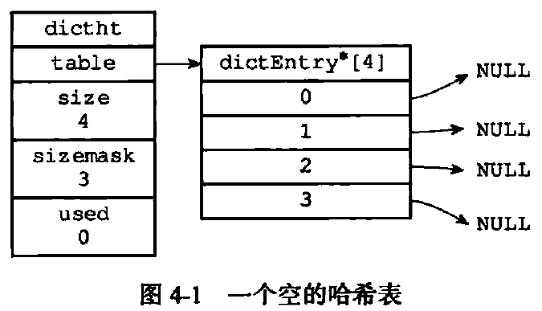
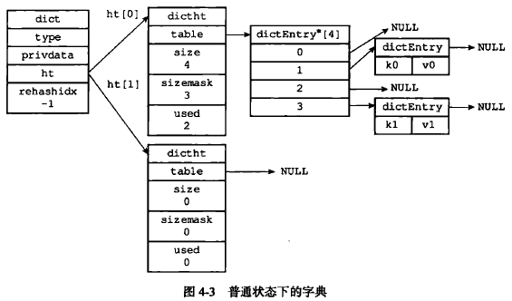

### 哈希表

```cpp
/* This is our hash table structure. Every dictionary has two of this as we
 * implement incremental rehashing, for the old to the new table. */
/*
 * 哈希表
 *
 * 每个字典都使用两个哈希表，从而实现渐进式 rehash 。
 */
typedef struct dictht {
  
    // 哈希表数组
    dictEntry **table;

    // 哈希表大小
    unsigned long size;
  
    // 哈希表大小掩码，用于计算索引值
    // 总是等于 size - 1
    unsigned long sizemask;

    // 该哈希表已有节点的数量
    unsigned long used;

} dictht;
```



### 哈希表节点

```cpp
/*
 * 哈希表节点
 */
typedef struct dictEntry {
  
    // 键
    void *key;

    // 值
    union {
        void *val;
        uint64_t u64;
        int64_t s64;
    } v;

    // 指向下个哈希表节点，形成链表
    // 将键相同的节点连接在一起，解决键冲突问题
    struct dictEntry *next;

} dictEntry;
```

> 关于 `union` 、类型值为空的指针、`int64_t` 有时间需要加强一下这方面的学习。

### 字典

```cpp
/*
 * 字典
 */
typedef struct dict {

    // 类型特定函数
    dictType *type;

    // 私有数据
    void *privdata;

    // 哈希表
    dictht ht[2];

    // rehash 索引
    // 当 rehash 不在进行时，值为 -1
    int rehashidx; /* rehashing not in progress if rehashidx == -1 */

    // 目前正在运行的安全迭代器的数量
    int iterators; /* number of iterators currently running */

} dict;

```

`type` 和 `privdata` 属性是针对不同类型的键值对，为创建多态字典而设置的。

`ht` 属性是一个包含两个项的数组，数组中的每一项都是一个 `dictht`哈希表，一般情况下，字典只使用 `ht[0]`哈希表，`ht[1]`哈希表只会在对 `ht[0]`哈希表进行 `rehash`时使用。

```cpp
/*
 * 字典类型特定函数
 */
typedef struct dictType {

    // 计算哈希值的函数
    unsigned int (*hashFunction)(const void *key);

    // 复制键的函数
    void *(*keyDup)(void *privdata, const void *key);

    // 复制值的函数
    void *(*valDup)(void *privdata, const void *obj);

    // 对比键的函数
    int (*keyCompare)(void *privdata, const void *key1, const void *key2);

    // 销毁键的函数
    void (*keyDestructor)(void *privdata, void *key);
  
    // 销毁值的函数
    void (*valDestructor)(void *privdata, void *obj);

} dictType;
```



### 哈希算法

```cpp
// 计算给定键的哈希值
#define dictHashKey(d, key) (d)->type->hashFunction(key)
hash = dict->type->hashFunction(key);

// 计算索引值
index = hash & dict->ht[table].sizemask;
```

首先，通过哈希函数计算出哈希值，然后，在通过哈希值与sizemask进行与操作，得到索引值。

### rehash

为了让哈希表的负载因子维持在一个合理的范围内，当哈希表保存的键值对数量太多或太少时，程序需要对哈希表的大小进行相应的扩展或者收缩。

`rehash`动作并不是一次性的、集中式地完成的，而是分多次、渐进式地完成的。避免了集中式 `rehash`带来的庞大计算量。

渐进式 `rehash`执行期间的哈希表操作：删除（delete）、查找（find）、更新（update）等操作会在两个哈希表上进行。以查找为例：如果在 `ht[0]`上进行查找没找到的话，就会继续到 `ht[1]`里面进行查找。如果是添加操作，则只会在 `ht[1]`上进行。

```cpp
/* Performs N steps of incremental rehashing. Returns 1 if there are still
 * keys to move from the old to the new hash table, otherwise 0 is returned.
 *
 * 执行 N 步渐进式 rehash 。
 *
 * 返回 1 表示仍有键需要从 0 号哈希表移动到 1 号哈希表，
 * 返回 0 则表示所有键都已经迁移完毕。
 *
 * Note that a rehashing step consists in moving a bucket (that may have more
 * than one key as we use chaining) from the old to the new hash table.
 *
 * 注意，每步 rehash 都是以一个哈希表索引（桶）作为单位的，
 * 一个桶里可能会有多个节点，
 * 被 rehash 的桶里的所有节点都会被移动到新哈希表。
 *
 * T = O(N)
 */
int dictRehash(dict *d, int n) {

    // 只可以在 rehash 进行中时执行
    if (!dictIsRehashing(d)) return 0;

    // 进行 N 步迁移
    // T = O(N)
    while(n--) {
        dictEntry *de, *nextde;

        /* Check if we already rehashed the whole table... */
        // 如果 0 号哈希表为空，那么表示 rehash 执行完毕
        // T = O(1)
        if (d->ht[0].used == 0) {
            // 释放 0 号哈希表
            zfree(d->ht[0].table);
            // 将原来的 1 号哈希表设置为新的 0 号哈希表
            d->ht[0] = d->ht[1];
            // 重置旧的 1 号哈希表
            _dictReset(&d->ht[1]);
            // 关闭 rehash 标识
            d->rehashidx = -1;
            // 返回 0 ，向调用者表示 rehash 已经完成
            return 0;
        }

        /* Note that rehashidx can't overflow as we are sure there are more
         * elements because ht[0].used != 0 */
        // 确保 rehashidx 没有越界
        assert(d->ht[0].size > (unsigned)d->rehashidx);

        // 略过数组中为空的索引，找到下一个非空索引
        while(d->ht[0].table[d->rehashidx] == NULL) d->rehashidx++;

        // 指向该索引的链表表头节点
        de = d->ht[0].table[d->rehashidx];
        /* Move all the keys in this bucket from the old to the new hash HT */
        // 将链表中的所有节点迁移到新哈希表
        // T = O(1)
        while(de) {
            unsigned int h;

            // 保存下个节点的指针
            nextde = de->next;

            /* Get the index in the new hash table */
            // 计算新哈希表的哈希值，以及节点插入的索引位置
            h = dictHashKey(d, de->key) & d->ht[1].sizemask;

            // 插入节点到新哈希表（头插法）
            de->next = d->ht[1].table[h];
            d->ht[1].table[h] = de;

            // 更新计数器
            d->ht[0].used--;
            d->ht[1].used++;

            // 继续处理下个节点
            de = nextde;
        }
        // 将刚迁移完的哈希表索引的指针设为空
        d->ht[0].table[d->rehashidx] = NULL;
        // 更新 rehash 索引
        d->rehashidx++;
    }

    return 1;
}
```

### 字典API

**dictCreate**

作用：创建一个新的字典

时间复杂度：O(1)

```cpp
/* Create a new hash table */
/*
 * 创建一个新的字典
 *
 * T = O(1)
 */
dict *dictCreate(dictType *type,
        void *privDataPtr)
{
    dict *d = zmalloc(sizeof(*d));

    _dictInit(d,type,privDataPtr);

    return d;
}

/* Initialize the hash table */
/*
 * 初始化哈希表
 *
 * T = O(1)
 */
int _dictInit(dict *d, dictType *type,
        void *privDataPtr)
{
    // 初始化两个哈希表的各项属性值
    // 但暂时还不分配内存给哈希表数组
    _dictReset(&d->ht[0]);
    _dictReset(&d->ht[1]);

    // 设置类型特定函数
    d->type = type;

    // 设置私有数据
    d->privdata = privDataPtr;

    // 设置哈希表 rehash 状态
    d->rehashidx = -1;

    // 设置字典的安全迭代器数量
    d->iterators = 0;

    return DICT_OK;
}

/* Reset a hash table already initialized with ht_init().
 * NOTE: This function should only be called by ht_destroy(). */
/*
 * 重置（或初始化）给定哈希表的各项属性值
 *
 * p.s. 上面的英文注释已经过期
 *
 * T = O(1)
 */
static void _dictReset(dictht *ht)
{
    ht->table = NULL;
    ht->size = 0;
    ht->sizemask = 0;
    ht->used = 0;
}
```

**dictAdd**

作用：将给定的键值对添加到字典里

时间复杂度：O(1)

```cpp
// 设置给定字典节点的值
#define dictSetVal(d, entry, _val_) do { \
    if ((d)->type->valDup) \
        entry->v.val = (d)->type->valDup((d)->privdata, _val_); \
    else \
        entry->v.val = (_val_); \
} while(0)

// 设置给定字典节点的键
#define dictSetKey(d, entry, _key_) do { \
    if ((d)->type->keyDup) \
        entry->key = (d)->type->keyDup((d)->privdata, _key_); \
    else \
        entry->key = (_key_); \
} while(0)

/* Add an element to the target hash table */
/*
 * 尝试将给定键值对添加到字典中
 *
 * 只有给定键 key 不存在于字典时，添加操作才会成功
 *
 * 添加成功返回 DICT_OK ，失败返回 DICT_ERR
 *
 * 最坏 T = O(N) ，平滩 O(1) 
 */
int dictAdd(dict *d, void *key, void *val)
{
    // 尝试添加键到字典，并返回包含了这个键的新哈希节点
    // T = O(N)
    dictEntry *entry = dictAddRaw(d,key);

    // 键已存在，添加失败
    if (!entry) return DICT_ERR;

    // 键不存在，设置节点的值
    // T = O(1)
    dictSetVal(d, entry, val);

    // 添加成功
    return DICT_OK;
}

/* Low level add. This function adds the entry but instead of setting
 * a value returns the dictEntry structure to the user, that will make
 * sure to fill the value field as he wishes.
 *
 * This function is also directly exposed to user API to be called
 * mainly in order to store non-pointers inside the hash value, example:
 *
 * entry = dictAddRaw(dict,mykey);
 * if (entry != NULL) dictSetSignedIntegerVal(entry,1000);
 *
 * Return values:
 *
 * If key already exists NULL is returned.
 * If key was added, the hash entry is returned to be manipulated by the caller.
 */
/*
 * 尝试将键插入到字典中
 *
 * 如果键已经在字典存在，那么返回 NULL
 *
 * 如果键不存在，那么程序创建新的哈希节点，
 * 将节点和键关联，并插入到字典，然后返回节点本身。
 *
 * T = O(N)
 */
dictEntry *dictAddRaw(dict *d, void *key)
{
    int index;
    dictEntry *entry;
    dictht *ht;

    // 如果条件允许的话，进行单步 rehash
    // T = O(1)
    if (dictIsRehashing(d)) _dictRehashStep(d);

    /* Get the index of the new element, or -1 if
     * the element already exists. */
    // 计算键在哈希表中的索引值
    // 如果值为 -1 ，那么表示键已经存在
    // T = O(N)
    if ((index = _dictKeyIndex(d, key)) == -1)
        return NULL;

    // T = O(1)
    /* Allocate the memory and store the new entry */
    // 如果字典正在 rehash ，那么将新键添加到 1 号哈希表
    // 否则，将新键添加到 0 号哈希表
    ht = dictIsRehashing(d) ? &d->ht[1] : &d->ht[0];
    // 为新节点分配空间
    entry = zmalloc(sizeof(*entry));
    // 将新节点插入到链表表头
    entry->next = ht->table[index];
    ht->table[index] = entry;
    // 更新哈希表已使用节点数量
    ht->used++;

    /* Set the hash entry fields. */
    // 设置新节点的键
    // T = O(1)
    dictSetKey(d, entry, key);

    return entry;
}
```

**dictReplace**

作用：将给定的键值对添加到字典里，如果键已经存在于字典，那么用新的值取代原有的值

时间复杂度：O(1)

```cpp
/* Add an element, discarding the old if the key already exists.
 *
 * 将给定的键值对添加到字典中，如果键已经存在，那么删除旧有的键值对。
 *
 * Return 1 if the key was added from scratch, 0 if there was already an
 * element with such key and dictReplace() just performed a value update
 * operation. 
 *
 * 如果键值对为全新添加，那么返回 1 。
 * 如果键值对是通过对原有的键值对更新得来的，那么返回 0 。
 *
 * T = O(N)
 */
int dictReplace(dict *d, void *key, void *val)
{
    dictEntry *entry, auxentry;

    /* Try to add the element. If the key
     * does not exists dictAdd will suceed. */
    // 尝试直接将键值对添加到字典
    // 如果键 key 不存在的话，添加会成功
    // T = O(N)
    if (dictAdd(d, key, val) == DICT_OK)
        return 1;

    /* It already exists, get the entry */
    // 运行到这里，说明键 key 已经存在，那么找出包含这个 key 的节点
    // T = O(1)
    entry = dictFind(d, key);
    /* Set the new value and free the old one. Note that it is important
     * to do that in this order, as the value may just be exactly the same
     * as the previous one. In this context, think to reference counting,
     * you want to increment (set), and then decrement (free), and not the
     * reverse. */
    // 先保存原有的值的指针
    auxentry = *entry;
    // 然后设置新的值
    // T = O(1)
    dictSetVal(d, entry, val);
    // 然后释放旧值
    // T = O(1)
    dictFreeVal(d, &auxentry);

    return 0;
}
```

**dictFetchValue**

作用：返回给定键的值

时间复杂度：O(1)

```cpp
/*
 * 获取包含给定键的节点的值
 *
 * 如果节点不为空，返回节点的值
 * 否则返回 NULL
 *
 * T = O(1)
 */
void *dictFetchValue(dict *d, const void *key) {
    dictEntry *he;

    // T = O(1)
    he = dictFind(d,key);

    return he ? dictGetVal(he) : NULL;
}

/*
 * 返回字典中包含键 key 的节点
 *
 * 找到返回节点，找不到返回 NULL
 *
 * T = O(1)
 */
dictEntry *dictFind(dict *d, const void *key)
{
    dictEntry *he;
    unsigned int h, idx, table;

    // 字典（的哈希表）为空
    if (d->ht[0].size == 0) return NULL; /* We don't have a table at all */

    // 如果条件允许的话，进行单步 rehash
    if (dictIsRehashing(d)) _dictRehashStep(d);

    // 计算键的哈希值
    h = dictHashKey(d, key);
    // 在字典的哈希表中查找这个键
    // T = O(1)
    for (table = 0; table <= 1; table++) {

        // 计算索引值
        idx = h & d->ht[table].sizemask;

        // 遍历给定索引上的链表的所有节点，查找 key
        he = d->ht[table].table[idx];
        // T = O(1)
        while(he) {

            if (dictCompareKeys(d, key, he->key))
                return he;

            he = he->next;
        }

        // 如果程序遍历完 0 号哈希表，仍然没找到指定的键的节点
        // 那么程序会检查字典是否在进行 rehash ，
        // 然后才决定是直接返回 NULL ，还是继续查找 1 号哈希表
        if (!dictIsRehashing(d)) return NULL;
    }

    // 进行到这里时，说明两个哈希表都没找到
    return NULL;
}
```

**dictGetRandomKey**

作用：从字典中随机返回一个键值对

时间复杂度：O(1)

```cpp
/* Return a random entry from the hash table. Useful to
 * implement randomized algorithms */
/*
 * 随机返回字典中任意一个节点。
 *
 * 可用于实现随机化算法。
 *
 * 如果字典为空，返回 NULL 。
 *
 * T = O(N)
*/
dictEntry *dictGetRandomKey(dict *d)
{
    dictEntry *he, *orighe;
    unsigned int h;
    int listlen, listele;

    // 字典为空
    if (dictSize(d) == 0) return NULL;

    // 进行单步 rehash
    if (dictIsRehashing(d)) _dictRehashStep(d);

    // 如果正在 rehash ，那么将 1 号哈希表也作为随机查找的目标
    if (dictIsRehashing(d)) {
        // T = O(N)
        do {
            h = random() % (d->ht[0].size+d->ht[1].size);
            he = (h >= d->ht[0].size) ? d->ht[1].table[h - d->ht[0].size] :
                                      d->ht[0].table[h];
        } while(he == NULL);
    // 否则，只从 0 号哈希表中查找节点
    } else {
        // T = O(N)
        do {
            h = random() & d->ht[0].sizemask;
            he = d->ht[0].table[h];
        } while(he == NULL);
    }

    /* Now we found a non empty bucket, but it is a linked
     * list and we need to get a random element from the list.
     * The only sane way to do so is counting the elements and
     * select a random index. */
    // 目前 he 已经指向一个非空的节点链表
    // 程序将从这个链表随机返回一个节点
    listlen = 0;
    orighe = he;
    // 计算节点数量, T = O(1)
    while(he) {
        he = he->next;
        listlen++;
    }
    // 取模，得出随机节点的索引
    listele = random() % listlen;
    he = orighe;
    // 按索引查找节点
    // T = O(1)
    while(listele--) he = he->next;

    // 返回随机节点
    return he;
}
```

**dictDelete**

作用：从字典中删除给定键所对应的键值对

时间复杂度：O(1)

```cpp
/*
 * 从字典中删除包含给定键的节点
 * 
 * 并且调用键值的释放函数来删除键值
 *
 * 找到并成功删除返回 DICT_OK ，没找到则返回 DICT_ERR
 * T = O(1)
 */
int dictDelete(dict *ht, const void *key) {
    return dictGenericDelete(ht,key,0);
}

/* Search and remove an element */
/*
 * 查找并删除包含给定键的节点
 *
 * 参数 nofree 决定是否调用键和值的释放函数
 * 0 表示调用，1 表示不调用
 *
 * 找到并成功删除返回 DICT_OK ，没找到则返回 DICT_ERR
 *
 * T = O(1)
 */
static int dictGenericDelete(dict *d, const void *key, int nofree)
{
    unsigned int h, idx;
    dictEntry *he, *prevHe;
    int table;

    // 字典（的哈希表）为空
    if (d->ht[0].size == 0) return DICT_ERR; /* d->ht[0].table is NULL */

    // 进行单步 rehash ，T = O(1)
    if (dictIsRehashing(d)) _dictRehashStep(d);

    // 计算哈希值
    h = dictHashKey(d, key);

    // 遍历哈希表
    // T = O(1)
    for (table = 0; table <= 1; table++) {

        // 计算索引值 
        idx = h & d->ht[table].sizemask;
        // 指向该索引上的链表
        he = d->ht[table].table[idx];
        prevHe = NULL;
        // 遍历链表上的所有节点
        // T = O(1)
        while(he) {
      
            if (dictCompareKeys(d, key, he->key)) {
                // 超找目标节点

                /* Unlink the element from the list */
                // 从链表中删除
                if (prevHe)
                    prevHe->next = he->next;
                else
                    d->ht[table].table[idx] = he->next;

                // 释放调用键和值的释放函数？
                if (!nofree) {
                    dictFreeKey(d, he);
                    dictFreeVal(d, he);
                }
              
                // 释放节点本身
                zfree(he);

                // 更新已使用节点数量
                d->ht[table].used--;

                // 返回已找到信号
                return DICT_OK;
            }

            prevHe = he;
            he = he->next;
        }

        // 如果执行到这里，说明在 0 号哈希表中找不到给定键
        // 那么根据字典是否正在进行 rehash ，决定要不要查找 1 号哈希表
        if (!dictIsRehashing(d)) break;
    }

    // 没找到
    return DICT_ERR; /* not found */
}
```

**dictRelease**

作用：释放给定字典，以及字典中包含的所有键值对

时间复杂度：O(N），N为字典包含的键值对数量

```cpp
/* Clear & Release the hash table */
/*
 * 删除并释放整个字典
 *
 * T = O(N)
 */
void dictRelease(dict *d)
{
    // 删除并清空两个哈希表
    _dictClear(d,&d->ht[0],NULL);
    _dictClear(d,&d->ht[1],NULL);
    // 释放节点结构
    zfree(d);
}

/* Destroy an entire dictionary */
/*
 * 删除哈希表上的所有节点，并重置哈希表的各项属性
 *
 * T = O(N)
 */
int _dictClear(dict *d, dictht *ht, void(callback)(void *)) {
    unsigned long i;

    /* Free all the elements */
    // 遍历整个哈希表
    // T = O(N)
    for (i = 0; i < ht->size && ht->used > 0; i++) {
        dictEntry *he, *nextHe;

        if (callback && (i & 65535) == 0) callback(d->privdata);

        // 跳过空索引
        if ((he = ht->table[i]) == NULL) continue;

        // 遍历整个链表
        // T = O(1)
        while(he) {
            nextHe = he->next;
            // 删除键
            dictFreeKey(d, he);
            // 删除值
            dictFreeVal(d, he);
            // 释放节点
            zfree(he);

            // 更新已使用节点计数
            ht->used--;

            // 处理下个节点
            he = nextHe;
        }
    }

    /* Free the table and the allocated cache structure */
    // 释放哈希表结构
    zfree(ht->table);

    /* Re-initialize the table */
    // 重置哈希表属性
    _dictReset(ht);

    return DICT_OK; /* never fails */
}
```
