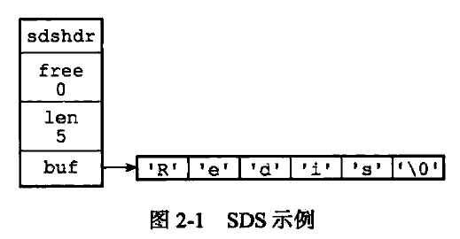

### 数据结构

```cpp
/*
 * 保存字符串对象的结构
 */
struct sdshdr {
  
    // buf 中已占用空间的长度
    int len;

    // buf 中剩余可用空间的长度
    int free;

    // 数据空间
    char buf[];
};
```



`buf`与C语言中的字符数组相同，最后 `\0`是字符串结束标志符，不计入字符长度。

**SDS与C语言中字符串的区别**

* 常数时间获取字符串长度 `len`
* 避免了缓冲区溢出

```cpp
/*
 * 将给定字符串 t 追加到 sds 的末尾
 * 
 * 返回值
 *  sds ：追加成功返回新 sds ，失败返回 NULL
 *
 * 复杂度
 *  T = O(N)
 */
/* Append the specified null termianted C string to the sds string 's'.
 *
 * After the call, the passed sds string is no longer valid and all the
 * references must be substituted with the new pointer returned by the call. */
sds sdscat(sds s, const char *t) {
    return sdscatlen(s, t, strlen(t));
}

/*
 * 将长度为 len 的字符串 t 追加到 sds 的字符串末尾
 *
 * 返回值
 *  sds ：追加成功返回新 sds ，失败返回 NULL
 *
 * 复杂度
 *  T = O(N)
 */
/* Append the specified binary-safe string pointed by 't' of 'len' bytes to the
 * end of the specified sds string 's'.
 *
 * After the call, the passed sds string is no longer valid and all the
 * references must be substituted with the new pointer returned by the call. */
sds sdscatlen(sds s, const void *t, size_t len) {
  
    struct sdshdr *sh;
  
    // 原有字符串长度
    size_t curlen = sdslen(s);

    // 扩展 sds 空间
    // T = O(N)
    s = sdsMakeRoomFor(s,len);

    // 内存不足？直接返回
    if (s == NULL) return NULL;

    // 复制 t 中的内容到字符串后部
    // T = O(N)
    sh = (void*) (s-(sizeof(struct sdshdr)));
    memcpy(s+curlen, t, len);

    // 更新属性
    sh->len = curlen+len;
    sh->free = sh->free-len;

    // 添加新结尾符号
    s[curlen+len] = '\0';

    // 返回新 sds
    return s;
}

/* Enlarge the free space at the end of the sds string so that the caller
 * is sure that after calling this function can overwrite up to addlen
 * bytes after the end of the string, plus one more byte for nul term.
 * 
 * Note: this does not change the *length* of the sds string as returned
 * by sdslen(), but only the free buffer space we have. */
/*
 * 对 sds 中 buf 的长度进行扩展，确保在函数执行之后，
 * buf 至少会有 addlen + 1 长度的空余空间
 * （额外的 1 字节是为 \0 准备的）
 *
 * 返回值
 *  sds ：扩展成功返回扩展后的 sds
 *        扩展失败返回 NULL
 *
 * 复杂度
 *  T = O(N)
 */
sds sdsMakeRoomFor(sds s, size_t addlen) {

    struct sdshdr *sh, *newsh;

    // 获取 s 目前的空余空间长度
    size_t free = sdsavail(s);

    size_t len, newlen;

    // s 目前的空余空间已经足够，无须再进行扩展，直接返回
    if (free >= addlen) return s;

    // 获取 s 目前已占用空间的长度
    len = sdslen(s);
    sh = (void*) (s-(sizeof(struct sdshdr)));

    // s 最少需要的长度
    newlen = (len+addlen);

    // 根据新长度，为 s 分配新空间所需的大小
    if (newlen < SDS_MAX_PREALLOC)
        // 如果新长度小于 SDS_MAX_PREALLOC 
        // 那么为它分配两倍于所需长度的空间
        newlen *= 2;
    else
        // 否则，分配长度为目前长度加上 SDS_MAX_PREALLOC
        newlen += SDS_MAX_PREALLOC;
    // T = O(N)
    newsh = zrealloc(sh, sizeof(struct sdshdr)+newlen+1);

    // 内存不足，分配失败，返回
    if (newsh == NULL) return NULL;

    // 更新 sds 的空余长度
    newsh->free = newlen - len;

    // 返回 sds
    return newsh->buf;
}

```

* 减少字符串修改带来的内存重分配次数
  * 预分配空间
    字符串拼接的过程中如果 `free`中剩余的长度小于要拼接的字符串，则需要对原来的字符串进行扩容，使扩容后的长度为拼接后字符串长度的2倍（空间允许的情况下）。
  * 惰性释放
