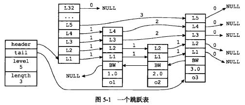

### 数据结构

```cpp
/* ZSETs use a specialized version of Skiplists */
/*
 * 跳跃表节点
 */
typedef struct zskiplistNode {

    // 成员对象
    robj *obj;

    // 分值
    double score;

    // 后退指针
    struct zskiplistNode *backward;

    // 层
    struct zskiplistLevel {

        // 前进指针
        struct zskiplistNode *forward;

        // 跨度
        unsigned int span;

    } level[];

} zskiplistNode;
```

跨度实际上是用来计算排位（rank）的：在查找某个节点的过程中，将沿途访问过的所有层的跨度累计起来，得到的结果就是目标节点在跳跃表中的排位。

```cpp
/*
 * 跳跃表
 */
typedef struct zskiplist {

    // 表头节点和表尾节点
    struct zskiplistNode *header, *tail;

    // 表中节点的数量
    unsigned long length;

    // 表中层数最大的节点的层数
    int level;

} zskiplist;
```



### 跳跃表API

**zslCreate**

作用：创建一个新的跳跃表

时间复杂度：O(1)

```cpp
/*
 * 创建并返回一个新的跳跃表
 *
 * T = O(1)
 */
zskiplist *zslCreate(void) {
    int j;
    zskiplist *zsl;

    // 分配空间
    zsl = zmalloc(sizeof(*zsl));

    // 设置高度和起始层数
    zsl->level = 1;
    zsl->length = 0;

    // 初始化表头节点
    // T = O(1)
    zsl->header = zslCreateNode(ZSKIPLIST_MAXLEVEL,0,NULL);
    for (j = 0; j < ZSKIPLIST_MAXLEVEL; j++) {
        zsl->header->level[j].forward = NULL;
        zsl->header->level[j].span = 0;
    }
    zsl->header->backward = NULL;

    // 设置表尾
    zsl->tail = NULL;

    return zsl;
}

/*
 * 创建一个层数为 level 的跳跃表节点，
 * 并将节点的成员对象设置为 obj ，分值设置为 score 。
 *
 * 返回值为新创建的跳跃表节点
 *
 * T = O(1)
 */
zskiplistNode *zslCreateNode(int level, double score, robj *obj) {
  
    // 分配空间
    zskiplistNode *zn = zmalloc(sizeof(*zn)+level*sizeof(struct zskiplistLevel));

    // 设置属性
    zn->score = score;
    zn->obj = obj;

    return zn;
}
```

**zslFree**

作用：释放给定跳跃表，以及表中包含的所有节点

时间复杂度：O(N)

```cpp
/*
 * 释放给定跳跃表，以及表中的所有节点
 *
 * T = O(N)
 */
void zslFree(zskiplist *zsl) {

    zskiplistNode *node = zsl->header->level[0].forward, *next;

    // 释放表头
    zfree(zsl->header);

    // 释放表中所有节点
    // T = O(N)
    while(node) {

        next = node->level[0].forward;

        zslFreeNode(node);

        node = next;
    }
  
    // 释放跳跃表结构
    zfree(zsl);
}
```

**zslInsert**

作用：将包含给定成员和分值的新节点添加到跳跃表中

时间复杂度：O(logN)

```cpp
/*
 * 创建一个成员为 obj ，分值为 score 的新节点，
 * 并将这个新节点插入到跳跃表 zsl 中。
 * 
 * 函数的返回值为新节点。
 *
 * T_wrost = O(N^2), T_avg = O(N log N)
 */
zskiplistNode *zslInsert(zskiplist *zsl, double score, robj *obj) {
    zskiplistNode *update[ZSKIPLIST_MAXLEVEL], *x;
    // 在查找的过程中，将沿途访问过的所有层的跨度累计起来，得到的结果就是
    // 目标节点在跳跃表中的排位。
    unsigned int rank[ZSKIPLIST_MAXLEVEL];
    int i, level;

    redisAssert(!isnan(score));

    // 在各个层查找节点的插入位置
    // T_wrost = O(N^2), T_avg = O(N log N)
    x = zsl->header;
    for (i = zsl->level-1; i >= 0; i--) {

        /* store rank that is crossed to reach the insert position */
        // 如果 i 不是 zsl->level-1 层
        // 那么 i 层的起始 rank 值为 i+1 层的 rank 值
        // 各个层的 rank 值一层层累积
        // 最终 rank[0] 的值加一就是新节点的前置节点的排位
        // rank[0] 会在后面成为计算 span 值和 rank 值的基础
        rank[i] = i == (zsl->level-1) ? 0 : rank[i+1];

        // 沿着前进指针遍历跳跃表
        // T_wrost = O(N^2), T_avg = O(N log N)
        while (x->level[i].forward &&
            (x->level[i].forward->score < score ||
                // 比对分值
                (x->level[i].forward->score == score &&
                // 比对成员， T = O(N)
                compareStringObjects(x->level[i].forward->obj,obj) < 0))) {

            // 记录沿途跨越了多少个节点
            rank[i] += x->level[i].span;

            // 移动至下一指针
            x = x->level[i].forward;
        }
        // 记录将要和新节点相连接的节点
        update[i] = x;
    }

    /* we assume the key is not already inside, since we allow duplicated
     * scores, and the re-insertion of score and redis object should never
     * happen since the caller of zslInsert() should test in the hash table
     * if the element is already inside or not. 
     *
     * zslInsert() 的调用者会确保同分值且同成员的元素不会出现，
     * 所以这里不需要进一步进行检查，可以直接创建新元素。
     */

    // 获取一个随机值作为新节点的层数
    // T = O(N)
    level = zslRandomLevel();

    // 如果新节点的层数比表中其他节点的层数都要大
    // 那么初始化表头节点中未使用的层，并将它们记录到 update 数组中
    // 将来也指向新节点
    if (level > zsl->level) {

        // 初始化未使用层
        // T = O(1)
        for (i = zsl->level; i < level; i++) {
            rank[i] = 0;
            update[i] = zsl->header;
            update[i]->level[i].span = zsl->length;
        }

        // 更新表中节点最大层数
        zsl->level = level;
    }

    // 创建新节点
    x = zslCreateNode(level,score,obj);

    // 将前面记录的指针指向新节点，并做相应的设置
    // T = O(1)
    for (i = 0; i < level; i++) {
  
        // 设置新节点的 forward 指针
        x->level[i].forward = update[i]->level[i].forward;
  
        // 将沿途记录的各个节点的 forward 指针指向新节点
        update[i]->level[i].forward = x;

        /* update span covered by update[i] as x is inserted here */
        // 计算新节点跨越的节点数量
        x->level[i].span = update[i]->level[i].span - (rank[0] - rank[i]);

        // 更新新节点插入之后，沿途节点的 span 值
        // 其中的 +1 计算的是新节点
        update[i]->level[i].span = (rank[0] - rank[i]) + 1;
    }

    /* increment span for untouched levels */
    // 未接触的节点的 span 值也需要增一，这些节点直接从表头指向新节点
    // T = O(1)
    for (i = level; i < zsl->level; i++) {
        update[i]->level[i].span++;
    }

    // 设置新节点的后退指针
    x->backward = (update[0] == zsl->header) ? NULL : update[0];
    if (x->level[0].forward)
        x->level[0].forward->backward = x;
    else
        zsl->tail = x;

    // 跳跃表的节点计数增一
    zsl->length++;

    return x;
}
```

**zslDelete**

作用：删除跳跃表中包含给定成员和分值的节点

时间复杂度：平均O(logN)，最坏O(N)

```cpp
/* Delete an element with matching score/object from the skiplist. 
 *
 * 从跳跃表 zsl 中删除包含给定节点 score 并且带有指定对象 obj 的节点。
 *
 * T_wrost = O(N^2), T_avg = O(N log N)
 */
int zslDelete(zskiplist *zsl, double score, robj *obj) {
    zskiplistNode *update[ZSKIPLIST_MAXLEVEL], *x;
    int i;

    // 遍历跳跃表，查找目标节点，并记录所有沿途节点
    // T_wrost = O(N^2), T_avg = O(N log N)
    x = zsl->header;
    for (i = zsl->level-1; i >= 0; i--) {

        // 遍历跳跃表的复杂度为 T_wrost = O(N), T_avg = O(log N)
        while (x->level[i].forward &&
            (x->level[i].forward->score < score ||
                // 比对分值
                (x->level[i].forward->score == score &&
                // 比对对象，T = O(N)
                compareStringObjects(x->level[i].forward->obj,obj) < 0)))

            // 沿着前进指针移动
            x = x->level[i].forward;

        // 记录沿途节点
        update[i] = x;
    }

    /* We may have multiple elements with the same score, what we need
     * is to find the element with both the right score and object. 
     *
     * 检查找到的元素 x ，只有在它的分值和对象都相同时，才将它删除。
     */
    x = x->level[0].forward;
    if (x && score == x->score && equalStringObjects(x->obj,obj)) {
        // T = O(1)
        zslDeleteNode(zsl, x, update);
        // T = O(1)
        zslFreeNode(x);
        return 1;
    } else {
        return 0; /* not found */
    }

    return 0; /* not found */
}

/* Internal function used by zslDelete, zslDeleteByScore and zslDeleteByRank 
 * 
 * 内部删除函数，
 * 被 zslDelete 、 zslDeleteRangeByScore 和 zslDeleteByRank 等函数调用。
 *
 * T = O(1)
 */
void zslDeleteNode(zskiplist *zsl, zskiplistNode *x, zskiplistNode **update) {
    int i;

    // 更新所有和被删除节点 x 有关的节点的指针，解除它们之间的关系
    // T = O(1)
    for (i = 0; i < zsl->level; i++) {
        if (update[i]->level[i].forward == x) {
            update[i]->level[i].span += x->level[i].span - 1;
            update[i]->level[i].forward = x->level[i].forward;
        } else {
            update[i]->level[i].span -= 1;
        }
    }

    // 更新被删除节点 x 的前进和后退指针
    if (x->level[0].forward) {
        x->level[0].forward->backward = x->backward;
    } else {
        zsl->tail = x->backward;
    }

    // 更新跳跃表最大层数（只在被删除节点是跳跃表中最高的节点时才执行）
    // T = O(1)
    while(zsl->level > 1 && zsl->header->level[zsl->level-1].forward == NULL)
        zsl->level--;

    // 跳跃表节点计数器减一
    zsl->length--;
}


```

**zslGetRank**

作用：返回包含给定成员和分值的节点在跳跃表中的排位

时间复杂度：平均O(logN），最坏O(N)

```cpp
/* Find the rank for an element by both score and key.
 *
 * 查找包含给定分值和成员对象的节点在跳跃表中的排位。
 *
 * Returns 0 when the element cannot be found, rank otherwise.
 *
 * 如果没有包含给定分值和成员对象的节点，返回 0 ，否则返回排位。
 *
 * Note that the rank is 1-based due to the span of zsl->header to the
 * first element. 
 *
 * 注意，因为跳跃表的表头也被计算在内，所以返回的排位以 1 为起始值。
 *
 * T_wrost = O(N), T_avg = O(log N)
 */
unsigned long zslGetRank(zskiplist *zsl, double score, robj *o) {
    zskiplistNode *x;
    unsigned long rank = 0;
    int i;

    // 遍历整个跳跃表
    x = zsl->header;
    for (i = zsl->level-1; i >= 0; i--) {

        // 遍历节点并对比元素
        while (x->level[i].forward &&
            (x->level[i].forward->score < score ||
                // 比对分值
                (x->level[i].forward->score == score &&
                // 比对成员对象
                compareStringObjects(x->level[i].forward->obj,o) <= 0))) {

            // 累积跨越的节点数量
            rank += x->level[i].span;

            // 沿着前进指针遍历跳跃表
            x = x->level[i].forward;
        }

        /* x might be equal to zsl->header, so test if obj is non-NULL */
        // 必须确保不仅分值相等，而且成员对象也要相等
        // T = O(N)
        if (x->obj && equalStringObjects(x->obj,o)) {
            return rank;
        }
    }

    // 没找到
    return 0;
}

```

**zslGetElementByRank**

作用：返回跳跃表在给定排位上的节点

时间复杂度：平均O(logN)，最坏O(N）

```cpp
/* Finds an element by its rank. The rank argument needs to be 1-based. 
 * 
 * 根据排位在跳跃表中查找元素。排位的起始值为 1 。
 *
 * 成功查找返回相应的跳跃表节点，没找到则返回 NULL 。
 *
 * T_wrost = O(N), T_avg = O(log N)
 */
zskiplistNode* zslGetElementByRank(zskiplist *zsl, unsigned long rank) {
    zskiplistNode *x;
    unsigned long traversed = 0;
    int i;

    // T_wrost = O(N), T_avg = O(log N)
    x = zsl->header;
    for (i = zsl->level-1; i >= 0; i--) {

        // 遍历跳跃表并累积越过的节点数量
        while (x->level[i].forward && (traversed + x->level[i].span) <= rank)
        {
            traversed += x->level[i].span;
            x = x->level[i].forward;
        }

        // 如果越过的节点数量已经等于 rank
        // 那么说明已经到达要找的节点
        if (traversed == rank) {
            return x;
        }

    }

    // 没找到目标节点
    return NULL;
}
```

**zslIsInRange**

作用：给定一个分值范围（range），比如0到15，20到28，诸如此类，如果跳跃表中有至少一个节点的分值在这个范围内，那么返回1，否则返回0

时间复杂度：通过跳跃表的表头节点和表尾节点，这个检测可以用O(1)复杂度完成

```cpp
/*
 * 检测给定值 value 是否大于（或大于等于）范围 spec 中的 min 项。
 *
 * 返回 1 表示 value 大于等于 min 项，否则返回 0 。
 *
 * T = O(1)
 */
static int zslValueGteMin(double value, zrangespec *spec) {
    return spec->minex ? (value > spec->min) : (value >= spec->min);
}

/*
 * 检测给定值 value 是否小于（或小于等于）范围 spec 中的 max 项。
 *
 * 返回 1 表示 value 小于等于 max 项，否则返回 0 。
 *
 * T = O(1)
 */
static int zslValueLteMax(double value, zrangespec *spec) {
    return spec->maxex ? (value < spec->max) : (value <= spec->max);
}

/* Struct to hold a inclusive/exclusive range spec by score comparison. */
// 表示开区间/闭区间范围的结构
typedef struct {

    // 最小值和最大值
    double min, max;

    // 指示最小值和最大值是否*不*包含在范围之内
    // 值为 1 表示不包含，值为 0 表示包含
    int minex, maxex; /* are min or max exclusive? */
} zrangespec;

/* Returns if there is a part of the zset is in range.
 *
 * 如果给定的分值范围包含在跳跃表的分值范围之内，
 * 那么返回 1 ，否则返回 0 。
 *
 * T = O(1)
 */
int zslIsInRange(zskiplist *zsl, zrangespec *range) {
    zskiplistNode *x;

    /* Test for ranges that will always be empty. */
    // 先排除总为空的范围值
    if (range->min > range->max ||
            (range->min == range->max && (range->minex || range->maxex)))
        return 0;

    // 检查最大分值
    x = zsl->tail;
    if (x == NULL || !zslValueGteMin(x->score,range))
        return 0;

    // 检查最小分值
    x = zsl->header->level[0].forward;
    if (x == NULL || !zslValueLteMax(x->score,range))
        return 0;

    return 1;
}
```

**zslFirstInRange**

作用：给定一个分值范围，返回跳跃表中第一个符合这个范围的节点

时间复杂度：平均O(logN)，最坏O(N）

```cpp
/* Find the first node that is contained in the specified range.
 *
 * 返回 zsl 中第一个分值符合 range 中指定范围的节点。
 * Returns NULL when no element is contained in the range.
 *
 * 如果 zsl 中没有符合范围的节点，返回 NULL 。
 *
 * T_wrost = O(N), T_avg = O(log N)
 */
zskiplistNode *zslFirstInRange(zskiplist *zsl, zrangespec *range) {
    zskiplistNode *x;
    int i;

    /* If everything is out of range, return early. */
    if (!zslIsInRange(zsl,range)) return NULL;

    // 遍历跳跃表，查找符合范围 min 项的节点
    // T_wrost = O(N), T_avg = O(log N)
    x = zsl->header;
    for (i = zsl->level-1; i >= 0; i--) {
        /* Go forward while *OUT* of range. */
        while (x->level[i].forward &&
            !zslValueGteMin(x->level[i].forward->score,range))
                x = x->level[i].forward;
    }

    /* This is an inner range, so the next node cannot be NULL. */
    x = x->level[0].forward;
    redisAssert(x != NULL);

    /* Check if score <= max. */
    // 检查节点是否符合范围的 max 项
    // T = O(1)
    if (!zslValueLteMax(x->score,range)) return NULL;
    return x;
}
```

**zslLastInRange**

作用：给定一个分值范围，返回跳跃表中最后一个符合这个范围的节点

时间复杂度：平均O(logN)，最坏O(N）

```cpp
/* Find the last node that is contained in the specified range.
 * Returns NULL when no element is contained in the range.
 *
 * 返回 zsl 中最后一个分值符合 range 中指定范围的节点。
 *
 * 如果 zsl 中没有符合范围的节点，返回 NULL 。
 *
 * T_wrost = O(N), T_avg = O(log N)
 */
zskiplistNode *zslLastInRange(zskiplist *zsl, zrangespec *range) {
    zskiplistNode *x;
    int i;

    /* If everything is out of range, return early. */
    // 先确保跳跃表中至少有一个节点符合 range 指定的范围，
    // 否则直接失败
    // T = O(1)
    if (!zslIsInRange(zsl,range)) return NULL;

    // 遍历跳跃表，查找符合范围 max 项的节点
    // T_wrost = O(N), T_avg = O(log N)
    x = zsl->header;
    for (i = zsl->level-1; i >= 0; i--) {
        /* Go forward while *IN* range. */
        while (x->level[i].forward &&
            zslValueLteMax(x->level[i].forward->score,range))
                x = x->level[i].forward;
    }

    /* This is an inner range, so this node cannot be NULL. */
    redisAssert(x != NULL);

    /* Check if score >= min. */
    // 检查节点是否符合范围的 min 项
    // T = O(1)
    if (!zslValueGteMin(x->score,range)) return NULL;

    // 返回节点
    return x;
}
```

**zslDeleteRangeByScore**

作用：给定一个分值范围，删除跳跃表中所有在这个范围之内的节点

时间复杂度：O(N)

```cpp
/* Delete all the elements with score between min and max from the skiplist.
 *
 * 删除所有分值在给定范围之内的节点。
 *
 * Min and max are inclusive, so a score >= min || score <= max is deleted.
 * 
 * min 和 max 参数都是包含在范围之内的，所以分值 >= min 或 <= max 的节点都会被删除。
 *
 * Note that this function takes the reference to the hash table view of the
 * sorted set, in order to remove the elements from the hash table too.
 *
 * 节点不仅会从跳跃表中删除，而且会从相应的字典中删除。
 *
 * 返回值为被删除节点的数量
 *
 * T = O(N)
 */
unsigned long zslDeleteRangeByScore(zskiplist *zsl, zrangespec *range, dict *dict) {
    zskiplistNode *update[ZSKIPLIST_MAXLEVEL], *x;
    unsigned long removed = 0;
    int i;

    // 记录所有和被删除节点（们）有关的节点
    // T_wrost = O(N) , T_avg = O(log N)
    x = zsl->header;
    for (i = zsl->level-1; i >= 0; i--) {
        while (x->level[i].forward && (range->minex ?
            x->level[i].forward->score <= range->min :
            x->level[i].forward->score < range->min))
                x = x->level[i].forward;
        update[i] = x;
    }

    /* Current node is the last with score < or <= min. */
    // 定位到给定范围开始的第一个节点
    x = x->level[0].forward;

    /* Delete nodes while in range. */
    // 删除范围中的所有节点
    // T = O(N)
    while (x &&
           (range->maxex ? x->score < range->max : x->score <= range->max))
    {
        // 记录下个节点的指针
        zskiplistNode *next = x->level[0].forward;
        zslDeleteNode(zsl,x,update);
        dictDelete(dict,x->obj);
        zslFreeNode(x);
        removed++;
        x = next;
    }
    return removed;
}
```

**zslDeleteRangeByRank**

作用：给定一个排位范围，删除跳跃表中所有在这个范围之内的节点

时间复杂度：O(N)

```cpp
/* Delete all the elements with rank between start and end from the skiplist.
 *
 * 从跳跃表中删除所有给定排位内的节点。
 *
 * Start and end are inclusive. Note that start and end need to be 1-based 
 *
 * start 和 end 两个位置都是包含在内的。注意它们都是以 1 为起始值。
 *
 * 函数的返回值为被删除节点的数量。
 *
 * T = O(N)
 */
unsigned long zslDeleteRangeByRank(zskiplist *zsl, unsigned int start, unsigned int end, dict *dict) {
    zskiplistNode *update[ZSKIPLIST_MAXLEVEL], *x;
    unsigned long traversed = 0, removed = 0;
    int i;

    // 沿着前进指针移动到指定排位的起始位置，并记录所有沿途指针
    // T_wrost = O(N) , T_avg = O(log N)
    x = zsl->header;
    for (i = zsl->level-1; i >= 0; i--) {
        while (x->level[i].forward && (traversed + x->level[i].span) < start) {
            traversed += x->level[i].span;
            x = x->level[i].forward;
        }
        update[i] = x;
    }

    // 移动到排位的起始的第一个节点
    traversed++;
    x = x->level[0].forward;
    // 删除所有在给定排位范围内的节点
    // T = O(N)
    while (x && traversed <= end) {

        // 记录下一节点的指针
        zskiplistNode *next = x->level[0].forward;

        // 从跳跃表中删除节点
        zslDeleteNode(zsl,x,update);
        // 从字典中删除节点
        dictDelete(dict,x->obj);
        // 释放节点结构
        zslFreeNode(x);

        // 为删除计数器增一
        removed++;

        // 为排位计数器增一
        traversed++;

        // 处理下个节点
        x = next;
    }

    // 返回被删除节点的数量
    return removed;
}
```
